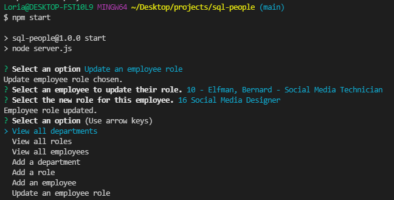

# sql-people

## Description
Picture this, you're refilling your coffee at the office and see an unfamiliar face. You introduce yourself and engage in the water cooler chat we all experienced pre-2020. The newbie says they're from the Media Management department and they're really enjoying Archie Lionsmane as their manager. You respond with an incredibly professional blank stare and mumble something about not even realizing your company had a Media Management department. The newbie walks away and you desperately wish your company had some sort of organizational system that could've prevented you from looking like the dispensable, goofy, third-wheel cartoon character.

Enter: SQL-People.

Now you can view your organization's departments, employees, and current job roles. Someone changed positions? SQL-People. Fresh meat just got hired? SQL-People. Added a Professional Punchliners department? Hey, you do you, but do it with SQL-People.

_App Sample Screenshots_

### Access

Clone the repository to your local machine, navigate to the root directory of the repository, then run "npm start" from the command line.

[Demo Video](https://watch.screencastify.com/v/zM8YwplMP16uq4TacMEL)

### Future Enhancements Roadmap

* add functionality for the following:
  - update employee managers (somewhat started)
  - view employees by manager
  - view employees by department
  - view total utilized budget of a department (combined salaries of all employees in that department)
* add ability to have inquirer prompts in global variables without losing async assignment
